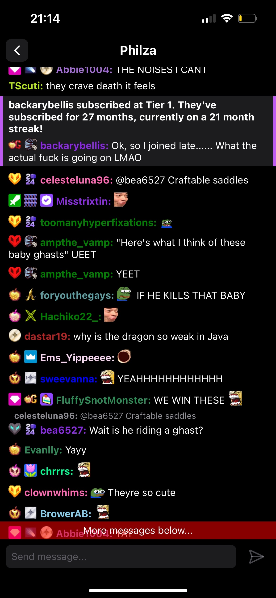

# chat-app

> [!WARNING]  
> The app is currently only tested on iOS, and most likely won't work out-of-the-box on Android!

A simple Twitch chat client mobile app written in React Native. It uses the official EventSub and Helix API's.

---

    
    

